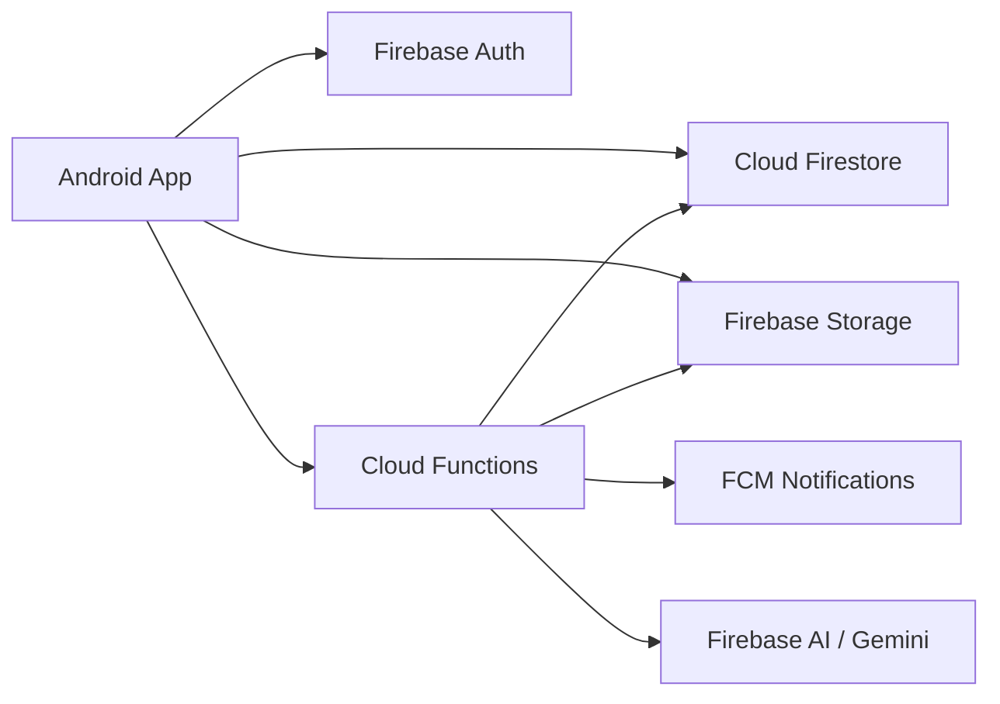

<p align="center">
  
</p>

<h1 align="center">FatiWeb Market</h1>

<p align="center">
  A Tunisia-first Android marketplace for clients, vendors, and admins, built with Firebase, Kotlin, smart search, cash on delivery, and optional voice assistance.
</p>

<p align="center">
  
  
  
  
</p>

---

## Overview

FatiWeb Market is a polished mobile commerce app designed around real marketplace workflows in Tunisia. It supports product discovery, guest shopping, client accounts, vendor product management, admin moderation, Firebase-powered cloud logic, and an accessibility-focused voice assistant called **FatiVoice**.

The project is organized as a production-ready Android app with a Firebase backend. The cleaned repository keeps the files needed to build, ship, and maintain the app while excluding local junk, generated build folders, temporary scripts, and private secrets.

## What Makes It Special

| Area | What FatiWeb Does |
| --- | --- |
| Marketplace | Browse products, filter collections, view details, add to cart, favorite items, and place cash-on-delivery orders. |
| Smart Search | Understands related terms such as `bebe`, `kids`, `baby`, `creme`, `cream`, `soin`, and similar marketplace words. |
| Guest Checkout | Guests can shop and place orders without being forced into an account first. |
| Vendor Workspace | Vendors can manage their products, save drafts, publish items, archive listings, and update shop profiles. |
| Admin Back Office | Admins can manage products, orders, clients, notifications, vendor access, and marketplace status. |
| FatiVoice | Optional voice assistant for accessibility, including spoken navigation, search, checkout guidance, and hands-free flows. |
| AI Assistance | Firebase Functions integrate AI-powered assistant/catalog helpers while keeping sensitive keys server-side. |

## App Roles

### Client Experience

- Modern home feed with curated product cards and image-led categories.
- Smart product search with filters for category, price, location, popularity, and newest items.
- Product detail pages with images, seller information, stock, variants, reviews, and add-to-cart actions.
- Favorites and cart flows optimized for repeated shopping.
- Guest checkout and account checkout.
- Cash on delivery order confirmation.
- Order history, order details, and delivery status tracking.
- In-app notifications and customer messaging.

### Vendor Experience

- Dedicated vendor dashboard and bottom navigation.
- Product creation and editing with images, price, stock, category, tags, description, and highlights.
- Draft, pending, published, rejected, archived, and lifecycle-aware product states.
- Vendor product filters and product status labels.
- Vendor shop profile management.
- Access control so vendors only manage their own catalog items.

### Admin Experience

- Admin dashboard for marketplace operations.
- Product moderation with filtered views for pending, rejected, draft, archived, and active products.
- Client management and role controls.
- Vendor promotion and access revocation through backend functions.
- Order management and status updates.
- Announcement and push notification tools.
- Firestore rules and backend callable functions aligned with admin/vendor permissions.

## FatiVoice

FatiVoice is an optional accessibility layer for users who need voice support. It is not forced on normal users.

Key behavior:

- First launch asks whether to enable voice assistance.
- If the user refuses, voice features stay disabled.
- When disabled, the bottom navigation behaves like a normal navigation bar with no center gap.
- When enabled, the centered voice button appears and can activate the assistant.
- Voice state persists after app restart.
- Inactivity activation is tied to the enabled state only.
- The assistant can guide search, cart, product reading, profile navigation, orders, and checkout flows.

Voice implementation lives under:

```text
app/src/main/java/isim/ia2y/myapplication/voice/
```

## Smart Search

The app includes an offline smart search system in:

```text
app/src/main/java/isim/ia2y/myapplication/SmartSearch.kt
```

It improves product discovery without calling an AI model on every keystroke. That keeps search fast, free, and stable for production.

Examples:

| User Types | Search Understands |
| --- | --- |
| `bebe`, `baby`, `kids`, `enfant` | Baby, kids, toys, strollers, diapers, school supplies |
| `creme`, `cream`, `soin`, `skincare` | Beauty, health, cosmetics, lotion, body care |
| `clothes`, `vetement`, `robe`, `shoes` | Fashion and clothing |
| `food`, `epicerie`, `bio` | Grocery and natural products |

The same search brain is used by product indexing, Firestore query tokens, and local fallback filtering.

## Tech Stack

| Layer | Technology |
| --- | --- |
| Mobile | Android, Kotlin, XML layouts, ViewBinding |
| UI | Material Components, ConstraintLayout, RecyclerView, ViewPager2 |
| Auth | Firebase Authentication |
| Database | Cloud Firestore |
| Storage | Firebase Storage |
| Backend | Firebase Cloud Functions with TypeScript |
| Notifications | Firebase Cloud Messaging |
| Monitoring | Firebase Crashlytics, Analytics, Performance |
| Security | Firestore rules, Storage rules, Firebase App Check, server-side role claims |
| AI | Firebase AI/Gemini-backed Cloud Functions |
| Voice | Android speech recognition, text-to-speech, FatiVoice orchestration |

## Architecture



## Repository Structure

```text
.
|-- app/                         Android application source
|   |-- src/main/java/            Kotlin activities, services, stores, and feature logic
|   |-- src/main/res/             Layouts, drawables, strings, colors, and app assets
|   |-- build.gradle.kts          Android module configuration
|
|-- firebase_functions_setup/     Firebase Cloud Functions backend
|   |-- src/assistant/            FatiBot and assistant calls
|   |-- src/catalog/              Product creation, deletion, AI catalog helpers
|   |-- src/orders/               Order creation and status updates
|   |-- src/reviews/              Review submission
|   |-- src/users/                User role and account functions
|
|-- public/                       Firebase Hosting pages
|   |-- privacy.html
|   |-- terms.html
|   |-- account-deletion.html
|
|-- delivery/                     Fresh release artifacts
|   |-- com.fatiweb.store.apk
|   |-- com.fatiweb.store.aab
|
|-- firestore.rules               Firestore security rules
|-- storage.rules                 Firebase Storage security rules
|-- firebase.json                 Firebase hosting/functions/firestore configuration
```

## Build Requirements

- Android Studio Ladybug or newer
- JDK 17
- Android SDK with compile SDK 36
- Node.js and npm for Firebase Functions
- Firebase CLI for deploying backend, rules, and hosting

## Local Android Build

On Windows:

```powershell
$env:JAVA_HOME='C:\Program Files\Android\Android Studio\jbr'
$env:Path="$env:JAVA_HOME\bin;$env:Path"
.\gradlew.bat :app:assembleDebug
```

Release build:

```powershell
.\gradlew.bat :app:assembleRelease :app:bundleRelease
```

Release signing is read from `local.properties` or environment variables:

```properties
RELEASE_STORE_FILE=path/to/keystore.jks
RELEASE_STORE_PASSWORD=your_store_password
RELEASE_KEY_ALIAS=your_key_alias
RELEASE_KEY_PASSWORD=your_key_password
```

Do not commit keystores, passwords, service accounts, or private API keys.

## Firebase Functions

Install and build the backend:

```powershell
npm --prefix firebase_functions_setup install
npm --prefix firebase_functions_setup run build
```

Deploy backend and rules when ready:

```powershell
firebase deploy --only functions,firestore:rules,firestore:indexes,storage,hosting
```

Sensitive AI and service credentials must stay in Firebase secrets or secure environment configuration, not in the Android app.

## Release Artifacts

The final generated release files are stored in:

```text
delivery/com.fatiweb.store.apk
delivery/com.fatiweb.store.aab
```

For Google Play publishing, use the `.aab`. The `.apk` is kept for direct install, local QA, and delivery review.

## Production Checklist

- Build release APK and AAB.
- Confirm `delivery/` contains the newest release files.
- Verify Firebase rules and Functions are deployed.
- Confirm privacy, terms, and account deletion pages are live through Firebase Hosting.
- Test client checkout, guest checkout, vendor product management, admin moderation, chat, notifications, search, and FatiVoice disabled/enabled states.
- Keep `junk/`, `.gradle/`, `.idea/`, `build/`, `node_modules/`, keystores, and local secrets out of Git.

## Current Package

| Property | Value |
| --- | --- |
| Application ID | `com.fatiweb.store` |
| Version Name | `1.0` |
| Version Code | `1` |
| Minimum SDK | `26` |
| Target SDK | `36` |
| Compile SDK | `36` |

## Design Direction

FatiWeb uses a clean premium marketplace style:

- Soft neutral surfaces.
- Rounded cards and polished product imagery.
- Clear hierarchy for scanning and shopping.
- Gold and dark neutral accents for premium actions.
- Dense but readable admin/vendor tools.
- Accessible voice support without forcing voice UI onto standard users.

## Security Notes

- Admin/vendor writes are protected by Firestore rules and backend role checks.
- Vendor product actions are scoped to the owner unless performed by an admin.
- Guest checkout is supported without exposing admin-only data.
- AI calls are routed through backend code so keys do not ship inside the APK.
- Local delivery/build artifacts are committed only when intentionally refreshed.

---

<p align="center">
  Built for a polished, accessible, Tunisia-first marketplace experience.
</p>
